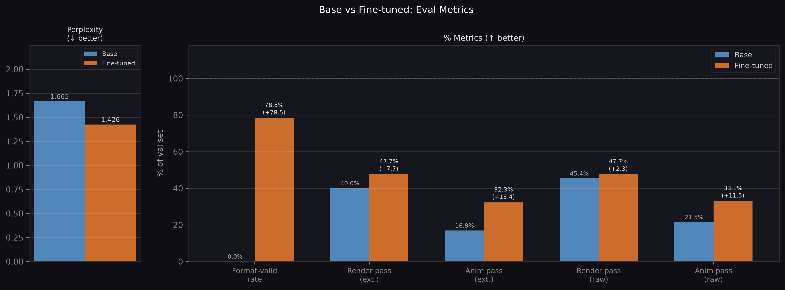
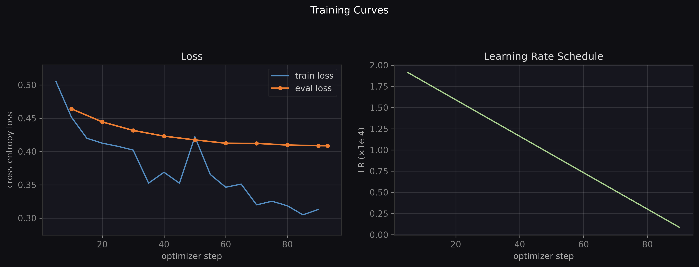

# keyframe-qwen-finetune

LoRA fine-tuning of **Qwen2.5-Coder-3B-Instruct** to generate CSS `@keyframes` animations from plain-English motion descriptions. Built as a 24-hour challenge.

## Results

| Metric | Base | Fine-tuned | Δ |
|--------|------|------------|---|
| Perplexity | 1.665 | 1.426 | −14% |
| Format-valid rate | 0.0% | 78.5% | +78.5pp |
| Render pass (extracted) | 40.0% | 47.7% | +7.7pp |
| Animation pass rate (extracted) | 16.9% | 32.3% | +15.4pp (~2×) |

**Animation pass** = renders successfully in a headless browser AND an LLM judge confirms it matches the brief. Evaluated on a held-out 130-example val set.




## Pipeline overview

```
justmalhar/fluent-dev (HF dataset)
    │
    ▼
prepare_data.py        filter to @keyframes rows, classify into animation buckets,
                       headless render check (must render + visibly move)
    │
    ▼
generate_data.py       supplement thin buckets with Claude-generated briefs + animations
                       (model cascade: haiku → sonnet → opus; per-batch caching)
    │
    ▼
split_data.py          iterative multilabel stratification → 80/20 train/val split
                       (494 train / 130 val)
    │
    ▼
train.py               bf16 LoRA SFT on Qwen2.5-Coder-3B-Instruct (TRL SFTTrainer)
                       completion-only loss, step-based checkpointing every 10 steps
    │
    ▼
eval.py                pass@1 greedy eval: generation → render check → LLM judge
                       cached per phase, A/B comparison vs base model
```

## Quickstart

```bash
# Install (uv manages the venv + CUDA torch wheel)
uv sync
uv run playwright install chromium      # headless render filter

# Build base dataset from HuggingFace
uv run python prepare_data.py           # -> data/keyframes_all.jsonl

# Supplement with Claude-generated examples (needs ANTHROPIC_API_KEY)
cp .env.example .env                    # add your key
uv run python generate_data.py --n 300 --batch-size 5 --workers 4

# Train/val split
uv run python split_data.py             # -> data/keyframes_train.jsonl + keyframes_val.jsonl

# Fine-tune (CUDA GPU required)
uv run python train.py                  # -> outputs/qwen3b-keyframes-lora/

# Evaluate base model
uv run python eval.py --tag base

# Evaluate fine-tuned model + A/B comparison
uv run python eval.py --tag ft --adapter outputs/qwen3b-keyframes-lora --compare base

# Visualise
uv run python make_plots.py             # -> outputs/plots/
uv run python make_preview.py          # -> outputs/preview.html (live animations)
```

## Key design choices

- **bf16 LoRA, not QLoRA** — Qwen 3B in bf16 (~6GB) fits a 16GB card with room; trains faster and cleaner than 4-bit. Pass `--use-4bit` to fall back.
- **Completion-only loss** — Qwen's chat template carries `` tags; `assistant_only_loss=True` masks the prompt tokens natively.
- **Render filter as quality gate** — every example (source and generated) must pass a headless Playwright check: renders without errors *and* has visible pixel motion via frame-diff. No static or broken animations in training data.
- **Knockout eval** — animation pass rate (render + LLM brief-match) is the HumanEval analog for this task: functional correctness, not just format. Reported separately from raw render rate.
- **Everything is resumable** — prompts flush per chunk, generated animations flush per kept row, training checkpoints every 10 steps, eval caches each phase. Nothing repeats on interruption.

## Hardware

Developed on RTX 4080 (16GB VRAM), CUDA 12.4. Training: ~93 optimizer steps over 3 epochs, ~1 hr.

## Project structure

```
generate_data.py       Claude-powered data generation pipeline
prepare_data.py        HuggingFace dataset filtering + bucket classification
split_data.py          Iterative multilabel stratification for train/val split
dataset_utils.py       Shared render filter + bucket utilities
prompting.py           Single source of truth for chat template (train/eval/inference)
train.py               LoRA SFT with TRL SFTTrainer
eval.py                Knockout evaluation harness
make_plots.py          Training curves + metrics comparison plots
make_preview.py        Side-by-side HTML preview of base vs fine-tuned outputs
verify_model.py        GPU smoke test

data/                  Datasets (tracked)
outputs/eval/          Eval cache + metrics JSON (tracked)
outputs/plots/         Generated plots (tracked)
outputs/preview.html   Animation preview (tracked)
outputs/qwen3b-keyframes-lora/  LoRA adapter weights (not tracked, >1GB)
docs/                  Extended documentation
```

## Environment

Copy `.env.example` to `.env` and fill in:

```
ANTHROPIC_API_KEY=...   # for data generation + eval judge
WANDB_API_KEY=...       # optional, pass --report-to none to skip
HF_TOKEN=...            # optional, speeds up model download
```
